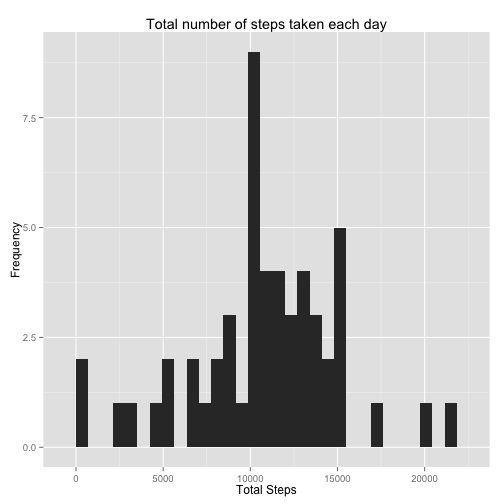
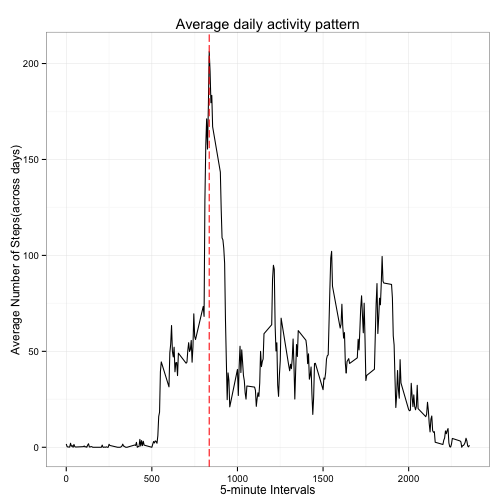
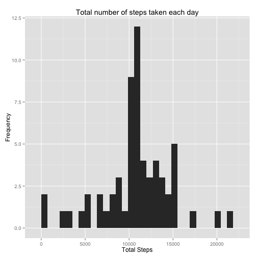
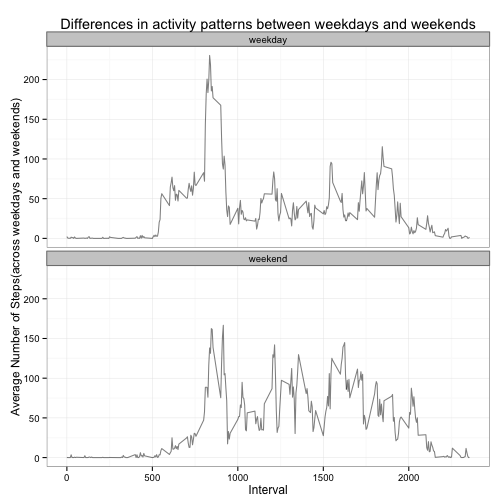

Reproducible Research: Peer Assessment 1
========================================================

## Loading and preprocessing the data

Loading the csv file using `read.csv` method into a data.frame `activityData` and flagging text `"NA"` strings.  


```r
# loading the data
activityData <- read.csv("activity.csv", na.strings = c("NA"))
```


#### Checking Data Consistency
Checking sample data and class of all data columns in order to find out what transformations need to be done.  
Also checking the number of `NAs` in the steps column

```r
# checking the data headers and sample data
head(activityData)
```

```
##   steps       date interval
## 1    NA 2012-10-01        0
## 2    NA 2012-10-01        5
## 3    NA 2012-10-01       10
## 4    NA 2012-10-01       15
## 5    NA 2012-10-01       20
## 6    NA 2012-10-01       25
```

```r
tail(activityData)
```

```
##       steps       date interval
## 17563    NA 2012-11-30     2330
## 17564    NA 2012-11-30     2335
## 17565    NA 2012-11-30     2340
## 17566    NA 2012-11-30     2345
## 17567    NA 2012-11-30     2350
## 17568    NA 2012-11-30     2355
```

```r
# checking class of all data columns
str(activityData)
```

```
## 'data.frame':	17568 obs. of  3 variables:
##  $ steps   : int  NA NA NA NA NA NA NA NA NA NA ...
##  $ date    : Factor w/ 61 levels "2012-10-01","2012-10-02",..: 1 1 1 1 1 1 1 1 1 1 ...
##  $ interval: int  0 5 10 15 20 25 30 35 40 45 ...
```

```r
# checking the number of NAs in the steps data
table(is.na(activityData$steps))
```

```
## 
## FALSE  TRUE 
## 15264  2304
```
Data is for 2 months - 2012-10-01 to 2012-11-30


#### Preprocessing Data
Doing basic preprocessing and transformations like 
- Changing date to correct format
- changing class `interval` column as factor 
Verifying the changes by checking the class of all columns using `str` method

```r
# changing the format of the date to proper date format
activityData$date <- as.Date(activityData$date, format="%Y-%m-%d")

# checking class of all data columns for verification of changes
str(activityData)
```

```
## 'data.frame':	17568 obs. of  3 variables:
##  $ steps   : int  NA NA NA NA NA NA NA NA NA NA ...
##  $ date    : Date, format: "2012-10-01" "2012-10-01" ...
##  $ interval: int  0 5 10 15 20 25 30 35 40 45 ...
```


## What is mean total number of steps taken per day?
For this part of the assignment, ignoring the missing values in the dataset.

#### Histogram of Steps per Day
Make a histogram of the total number of steps taken each day
Using `plyr` package to summarize and find the sum of steps taken per day and creating a data.frame to store that data.

```r
library(plyr)

totalDaySteps <- ddply(na.omit(activityData), .(date), summarize, sumSteps = sum(steps))
head(totalDaySteps)
```

```
##         date sumSteps
## 1 2012-10-02      126
## 2 2012-10-03    11352
## 3 2012-10-04    12116
## 4 2012-10-05    13294
## 5 2012-10-06    15420
## 6 2012-10-07    11015
```

Plotting the histogram using `totalDaySteps` data.frame  
Using `ggplot2` package for plotting the histogram

```r
library(ggplot2)
qplot(sumSteps, data=totalDaySteps, main="Total number of steps taken each day", xlab="Total Steps", ylab="Frequency")
```

```
## stat_bin: binwidth defaulted to range/30. Use 'binwidth = x' to adjust this.
```

 


Calculate and report the mean and median total number of steps taken per day


```r
library(plyr)
# looking at mean and median of data per day ignoring missing values
meanDaySteps <- ddply(na.omit(activityData), .(date), summarize, meanSteps = mean(steps))
head(totalDaySteps)
```

```
##         date sumSteps
## 1 2012-10-02      126
## 2 2012-10-03    11352
## 3 2012-10-04    12116
## 4 2012-10-05    13294
## 5 2012-10-06    15420
## 6 2012-10-07    11015
```

```r
medianDaySteps <- ddply(na.omit(activityData), .(date), summarize, MedianSteps = median(steps))
head(totalDaySteps)
```

```
##         date sumSteps
## 1 2012-10-02      126
## 2 2012-10-03    11352
## 3 2012-10-04    12116
## 4 2012-10-05    13294
## 5 2012-10-06    15420
## 6 2012-10-07    11015
```

```r
# calculating the mean and median of total number of steps
mean(totalDaySteps$sumSteps)
```

```
## [1] 10766
```

```r
median(totalDaySteps$sumSteps)
```

```
## [1] 10765
```


## What is the average daily activity pattern?

#### Time Series Plot of Intervals and average steps over all days
Make a time series plot (i.e. type = "l") of the 5-minute interval (x-axis) and   
the average number of steps taken, averaged across all days (y-axis)

Calculating the mean of all `288` 5-minute intervals over all days of available data  
and validating the calculated data

```r
library(plyr)
# creating data.frame to calculate the mean of 5-min intervals across all days for available data
intervalMean <- ddply(na.omit(activityData), .(interval), summarize, meanSteps = mean(steps))

# validating the data.frame that was created
head(intervalMean)
```

```
##   interval meanSteps
## 1        0   1.71698
## 2        5   0.33962
## 3       10   0.13208
## 4       15   0.15094
## 5       20   0.07547
## 6       25   2.09434
```

```r
tail(intervalMean)
```

```
##     interval meanSteps
## 283     2330    2.6038
## 284     2335    4.6981
## 285     2340    3.3019
## 286     2345    0.6415
## 287     2350    0.2264
## 288     2355    1.0755
```

```r
# checking of the mean was obtained for all intervals
nrow(intervalMean)
```

```
## [1] 288
```

Plotting the time series plot using `intervalMean` data.frame  
Using `ggplot2` package for plotting the time series plot  

```r
library(ggplot2)

# setting the plot space parameters with par and mfrow to set plot for one row and column
par(mfrow = c(1, 1))

# checking the max value for average number of steps for intervals
maxSteps <- intervalMean[intervalMean$meanSteps == max(intervalMean$meanSteps),]

# Plotting the time series plot
dailyPatternPlot <- ggplot(intervalMean, aes(x = interval, y = meanSteps))
dailyPatternPlot + geom_line(linetype=1) + labs(x ="5-minute Intervals") + labs(y="Average Number of Steps(across days)") + labs(title="Average daily activity pattern") + theme_bw() + geom_vline(xintercept = maxSteps$interval, color="red", linetype="longdash")
```

 


Which 5-minute interval, on average across all the days in the dataset, contains the maximum number of steps?  

output of details of iterval with 

```r
# checking the max value for average number of steps for intervals
maxSteps <- intervalMean[intervalMean$meanSteps == max(intervalMean$meanSteps),]

# output of details of iterval with max number of average steps
maxSteps
```

```
##     interval meanSteps
## 104      835     206.2
```
The output shows interval `835` has maximum number of average steps `206.1698`


## Imputing missing values

Calculate and report the total number of missing values in the dataset (i.e. the total number of rows with NAs)

```r
# checking the number of NAs in the steps data
table(is.na(activityData$steps))
```

```
## 
## FALSE  TRUE 
## 15264  2304
```


Devise a strategy for filling in all of the missing values in the dataset.   
The strategy does not need to be sophisticated. For example, you could use the mean/median for that day,   
or the mean for that 5-minute interval, etc.
#### Sterategy for imputing missing values
- Create a data.farme `(intervalMean)` of mean of steps for each 5-minute time interval, which was created in previous step.
- Add a new column `meanSteps` which shows the means for to the original `activityData` data.frame, which shows the mean for each associated `interval` . This is achieved by joining the two data.frames 
- Then find the values all `NA` values using `is.na(imputedActivityData$steps)` and update those with average values for thet interval  


```r
# creating a data.frame and adding a column meanSteps to reflect the mean of each time interval
imputedActivityData <- join(activityData, intervalMean, by="interval")

# checking the data and updated values
head(imputedActivityData)
```

```
##   steps       date interval meanSteps
## 1    NA 2012-10-01        0   1.71698
## 2    NA 2012-10-01        5   0.33962
## 3    NA 2012-10-01       10   0.13208
## 4    NA 2012-10-01       15   0.15094
## 5    NA 2012-10-01       20   0.07547
## 6    NA 2012-10-01       25   2.09434
```

Create a new dataset that is equal to the original dataset but with the missing data filled in.  
Creating Imputed Data

```r
# update the NAs with average values
imputedActivityData$steps[is.na(imputedActivityData$steps)] <- imputedActivityData$meanSteps[is.na(imputedActivityData$steps)]

# checking the data and updated values
head(imputedActivityData)
```

```
##     steps       date interval meanSteps
## 1 1.71698 2012-10-01        0   1.71698
## 2 0.33962 2012-10-01        5   0.33962
## 3 0.13208 2012-10-01       10   0.13208
## 4 0.15094 2012-10-01       15   0.15094
## 5 0.07547 2012-10-01       20   0.07547
## 6 2.09434 2012-10-01       25   2.09434
```


Make a histogram of the total number of steps taken each day and Calculate and report the mean and median total number of steps taken per day. 

Calculating total number of steps in imputed data and plotting histogram

```r
library(plyr)
#  total number of steps taken each day
totalDayStepsImputed <- ddply(imputedActivityData, .(date), summarize, sumSteps = sum(steps))
head(totalDayStepsImputed)
```

```
##         date sumSteps
## 1 2012-10-01    10766
## 2 2012-10-02      126
## 3 2012-10-03    11352
## 4 2012-10-04    12116
## 5 2012-10-05    13294
## 6 2012-10-06    15420
```

```r
# ploting updated histogram
library(ggplot2)
qplot(sumSteps, data=totalDayStepsImputed, main="Total number of steps taken each day", xlab="Total Steps", ylab="Frequency")
```

```
## stat_bin: binwidth defaulted to range/30. Use 'binwidth = x' to adjust this.
```

 

Do these values differ from the estimates from the first part of the assignment? What is the impact of imputing missing data on the estimates of the total daily number of steps?


```r
# calculating the mean and median of total number of steps
mean(totalDaySteps$sumSteps)
```

```
## [1] 10766
```

```r
median(totalDaySteps$sumSteps)
```

```
## [1] 10765
```


## Are there differences in activity patterns between weekdays and weekends?
Create a new factor variable in the dataset with two levels – “weekday” and “weekend” indicating whether 
a given date is a weekday or weekend day.

Creating a new data.frame for this plot `weekImpActivityData`  
Logic for adding weekday and weekend factor levels
- Adding `dayType` column to data.frame and update values as weekdays
- Create a logical vector for `weekend` which dtermines if the date is in Satusrday or Sunday.
- Use the logical vecor to update dayType to "Weekend" for which the value of logical vecor weekend is TRUE


```r
# weekday and weekend factors
weekImpActivityData <- imputedActivityData
weekImpActivityData$dayType <- "weekday"

# set up logical/test vector
weekend <- weekdays(as.Date(weekImpActivityData$date)) %in% c("Saturday", "Sunday") 

# Updating dayType to "Weekend" for which the value of logical vecor weekend is TRUE
weekImpActivityData$dayType[weekend] <- "weekend" 

# updating the datType to be a factor
weekImpActivityData$dayType <- factor(weekImpActivityData$dayType)
```

Make a panel plot containing a time series plot (i.e. type = "l") of the 5-minute interval (x-axis) and the average number of steps taken, averaged across all weekday days or weekend days (y-axis). The plot should look something like the following, which was creating using simulated data:


Creating a dataset to calculate average of steps over weekdays and average of steps over weekends for each interval using `plyr` package

```r
# creating a dataset to calculate average of steps over weekdays and average of steps over weekends for each intervals
intervalMeanDayType <- ddply(weekImpActivityData, .(dayType, interval), summarize, meanSteps = mean(steps))

# creating teh panel plot using ggplot2
library(ggplot2)
dayTypePlot <- ggplot(intervalMeanDayType, aes(interval, meanSteps))
dayTypePlot + geom_line(alpha=1/2) + facet_wrap(~ dayType, ncol=1) + labs(x ="Interval") + labs(y="Average Number of Steps(across weekdays and weekends)") + labs(title="Differences in activity patterns between weekdays and weekends") + theme_bw()
```

 

The plots shows the differences in weekend and weekday activity.

